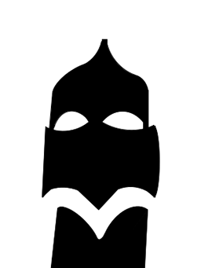
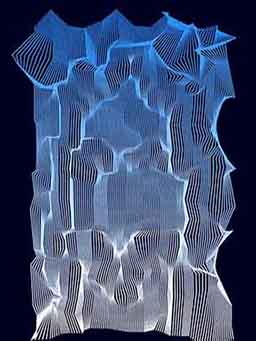

[](https://pypi.org/project/silhouette2wireframe/)
[](https://pypi.org/project/silhouette2wireframe/)
[](https://opensource.org/licenses/MIT)

# silhouette2wireframe

## Convert silhouette image to wireframe distorted by Perlin noise
#

# Installation
```
pip install silhouette2wireframe
```


# Convert silhouette image to a wireframe

```
from silhouette2wireframe import ImageToWireframe

converter = ImageToWireframe("silhouette.png", size=(1080,1350))

colors = {"bg": "#000022", "top": "dodgerblue", "bottom": "white"} 
fig = converter.draw_frame(0, cdict=colors)
plt.show()
```





